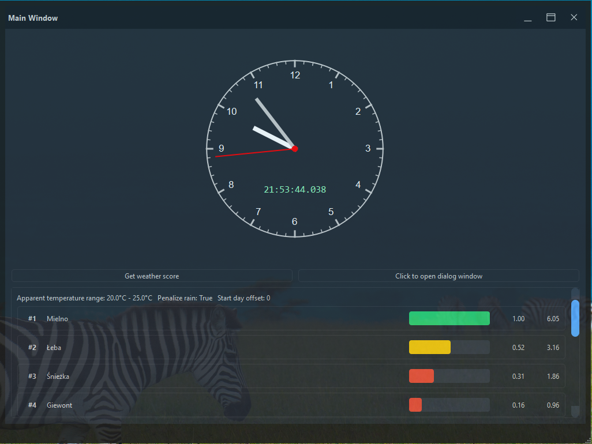
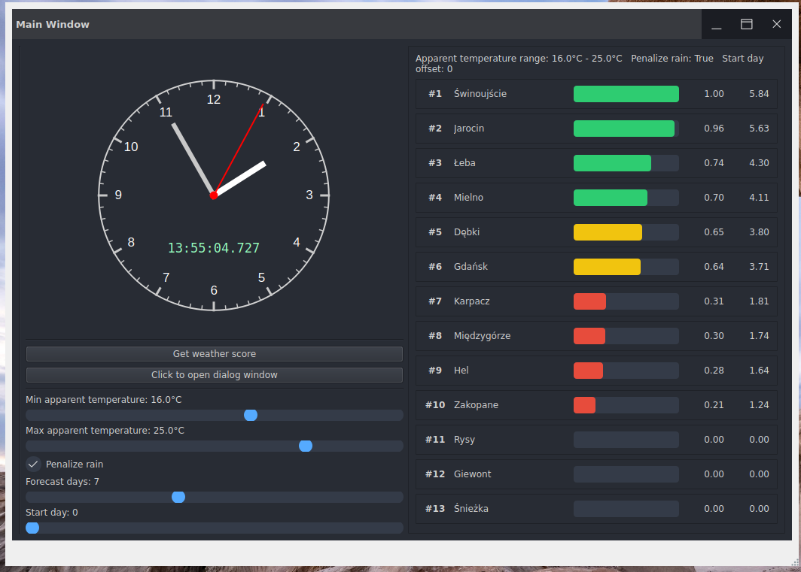
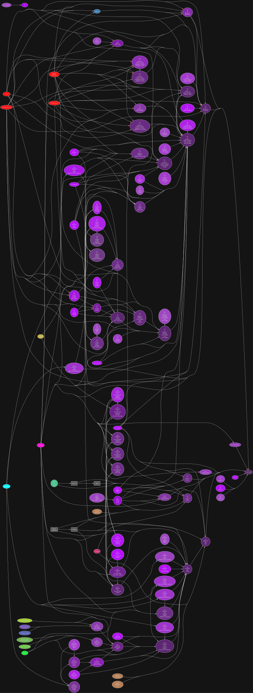
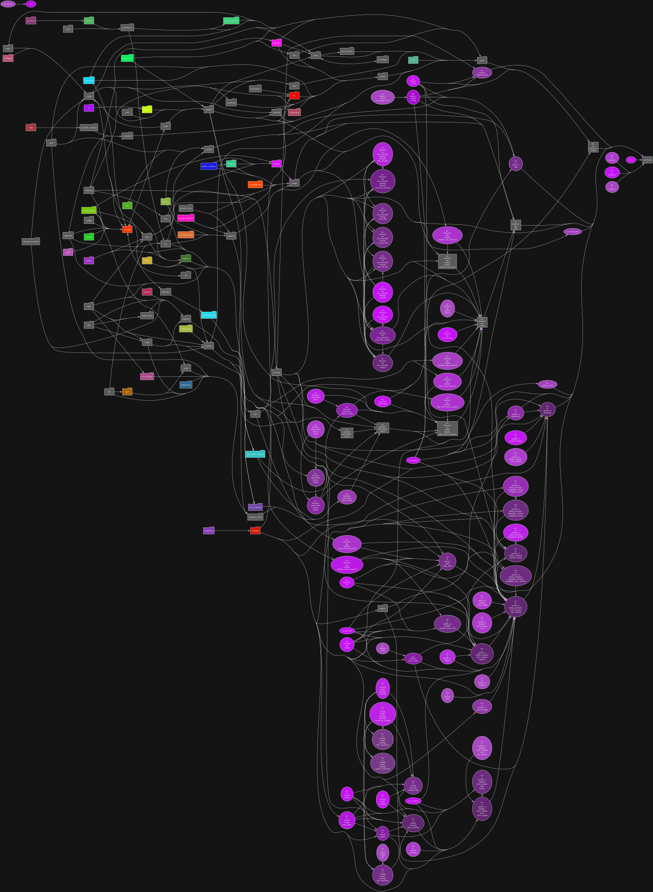
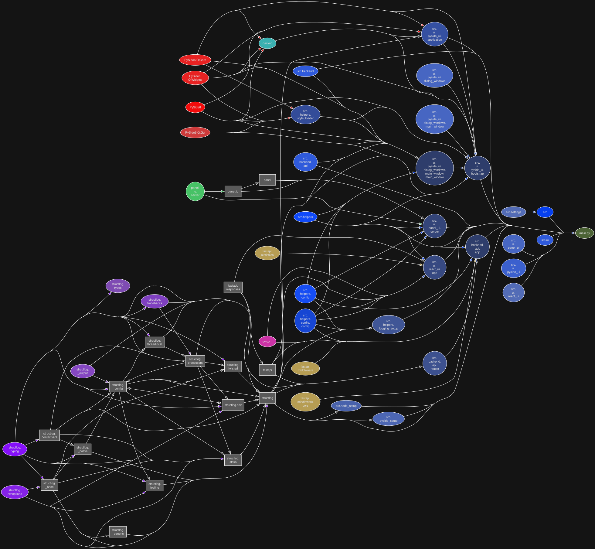
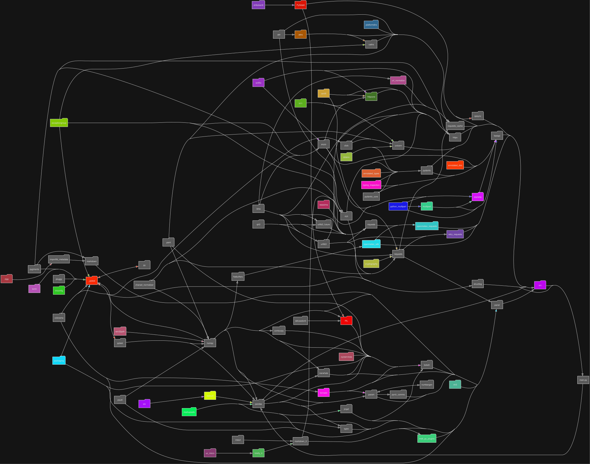

# Python Standalone GUI template

### Executable files do download for Windows and Linux

<table align="center">
  <tr>
    <th style="text-align: center;">Windows (click on image):</th>
    <th style="width: 50px;"></th>
    <th style="text-align: center;">Linux (click on image):</th>
  </tr>
  <tr>
    <td align="center">
      <a href="https://github.com/DariuszMak/python-standalone-gui-template/releases/download/0.24.0/GUI_client.exe">
        
      </a>
    </td>
    <td></td>
    <td align="center">
      <a href="https://github.com/DariuszMak/python-standalone-gui-template/releases/download/0.24.0/GUI_client">
        
      </a>
    </td>
  </tr>
</table>

### Project structure diagrams

#### Module perspective

##### Pure modular perspective

<p align="center">
  
</p>

##### Library dependencies modular perspective

<p align="center">
  
</p>

#### Runner perspective

##### Pure runner perspective

<p align="center">
  
</p>

##### Library dependencies runner perspective

<p align="center">
  
</p>

## Requirements

- [UV](https://github.com/astral-sh/uv) package manager
- [Task](https://taskfile.dev/docs/installation) runner
- [Docker Desktop](https://www.docker.com/products/docker-desktop)

## Local development (Windows PowerShell)

You can also use VSCode `settings.json` and `launch.json` files to run the project (choose interpreter created by UV).

### Fast Windows dev

```console
task full-dev-native ; 
```

### Full analysis

```console
task full-static-analyzis ; 
```

### Full release setup (Windows + Linux)

```console
task full-release-setup ; 
```

### Local development

```console
clear ; task local-static-tests ; task local-dev-native-run ; 
```

##### Local links

- http://127.0.0.1:8000/openapi.json
- http://127.0.0.1:8000/redoc
- http://127.0.0.1:8000/docs
- http://127.0.0.1:8001 (Panel UI)
- http://127.0.0.1:8002 (VueJs UI)


### Edit `ui` forms with QT Designer

```console
uv run pyside6-designer src\ui\pyside_ui\forms\main_window.ui ; 
uv run pyside6-designer src\ui\pyside_ui\forms\settings_dialog.ui ; 
```

#### GUI files specification

<mark>.qrc</mark> - resources file edited in QT Designer

<mark>.ui</mark> - QT Designer form

<mark>ui_*.py</mark> - QT Designer generated tools
